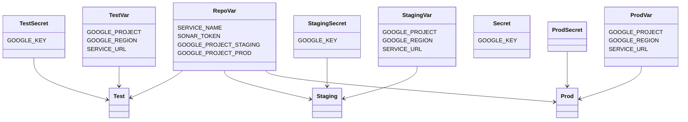

# Setup project on Google Cloud with GitHub Actions and Continuous Integration

Phexpedition requires Google Cloud to run. This means we assume:

- you have basic knowledge about Google Cloud, at least in these areas:
    - Service Accounts (SA) in Identity and Access Management (IAM)
    - Google Cloud Run
- you already have set up a Google Cloud project for these stages (or modify CI/CD pileine accordingly):
    - `Test`: Stage for non-local development and testing
    - `Prod`: for production and beta stages

If not stated otherwise, we assume the following instructions to be followed per stage.

We employ these technologies, products or facilities in order to build and operate Phexpedition:

- GitHub
    - Git Source Control Management (SCM)
    - GitHub Actions for:
        - building sources using Java and Maven
        - unit testing using Java and maven
        - setting up _some_ Google Cloud resources with `gcloud` CLI (no Terraform yet)
        - deploying artifacts to Google Cloud
    - GitHub Environments (e.g. `test` and `production` with dedicated variables and secrets per stage)
- Google Cloud
    - Cloud Build triggered by GitHub actions (using Build Packs)
    - Cloud Run for the application itself
    - several related and required facilities like IAM etc.

These two file make up CI/CD:

- `google-cloud-setup-project.yml`: action to (typically) setup your Google projects *once* (together with some manual steps)
- `ci-pipeline.yml`: ongoing CI/CD pipeline

## 1st time setup - manual steps

### Create Google Cloud project (per stage)

When having logged in to [Google Cloud Console](https://console.cloud.google.com),
make sure to create a new project per stage. Unless you disabled or edit GitHub Actions Environments and workflow, these are currently:

- `phexpedition-test`: development and testing
- `phexpedition-staging`: staging environment used to test perior deploying to production
- `phexpedition`: production

Production and staging use the Cloud Run image built in `phexpedition-stage`. In order to get
it working, we require the Google Artifact Registry, not the obsolete Container Registry.
Upon first Cloud Run deployment, you might get a timeout/error 1. In this case, use
the Google Cloud Console and go to Container Registry and activate using the new
Artifact Registry via `Transition to Artifact Registry` dialog there.

### Create CI/CD service account (per stage)

Go to *IAM* and create a new service account to be used by GitHub Actions
for further setting up your project and doing CI/CD:

- _Service account Name_: `github`
- _Service account ID_: `github`
- _Service account description_: `GitHub CI service account`
- Roles:
    - `Cloud Deploy Admin` (required for build app with Build Pack)
    - `Service Usage Admin` (required to enable APIs)
    - `Service Account Admin` (required to create service accounts such as for Cloud Run)
    - `Security Admin` (required for getting/adding IAM role bindings to service accounts)
    - `Artifact Registry Administrator` (required to push container image through Build Pack)
    - `Artifact Registry Service Agent`
    - `Cloud Run Admin` (required to actually re-deploy Cloud Run instance)
    - `Service Usage Consumer` (required for intermediate Cloud Storage)
    - `Storage Object Admin` (same)
    - `Cloud Deploy Service Agent` (hard to find that this is required...)

### Setup GitHub Actions Environment (per stage)

In you repository fork, go to _Settings_ &rarr; _Environments_ &rarr; _New environment_ (or choose existing one).
Then add these secrets and variables:

- Repository variables
  - `SERVICE_NAME`: name of the service used for Cloud Run, e.g. `phexpedition-app`
  - `GOOGLE_REGION`: you deployment region, e.g. `europe-west1`
  - `SONAR_TOKEN` (secret): API key from [SonarCloud](https://sonarcloud.io) used for doing QA against the code
- per stage variables/secrets
  - `GOOGLE_PROJECT`: ID of your Google project for that stage, e.g. `phex-test-12345`
  - `SERVICE_URL`: your URL to the application (current stage) - may be the generated Cloud Run URL or a custom mapped DNS name, e.g. `https://test.phexpedition.net`
  - `GOOGLE_KEY` (secret): JSON key file contents of the operating Google Service account in charge for deployment (`github`)

### Initialize Google Cloud project

In GitHub, go to _Actions_. On the left pane, you should see _Initialize Google Cloud Project_ workflow.
Select it and click _Run workflow_ on the upper right (from main branch).

Since this workflow is typically only upon first setup, you have to manually
approve it using _Review deployments_ &rarr; [Environment].

## Continuous Integration and Deployment (CI/CD)

This is the basic flow on how we do CI/CD:

- Sources are in GitHub repository
- commits trigger GitHub Actions
- we trigger Maven tests and Sonarcloud scans
- when OK, we use Google Cloud Build with BuildPacks (so, no custom `Dockerfile`)
- when OK, Cloud Run service is deployed to *Test* stage
- when OK:
  - *Staging* is deployed from container image built in test project
  - *Prod* is deployed from container image built in test project